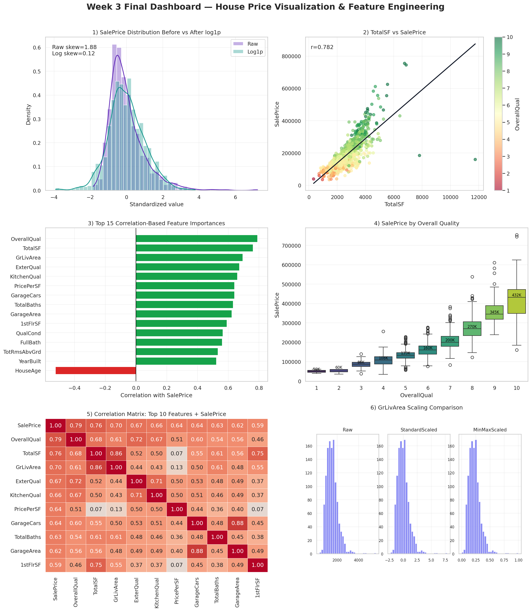
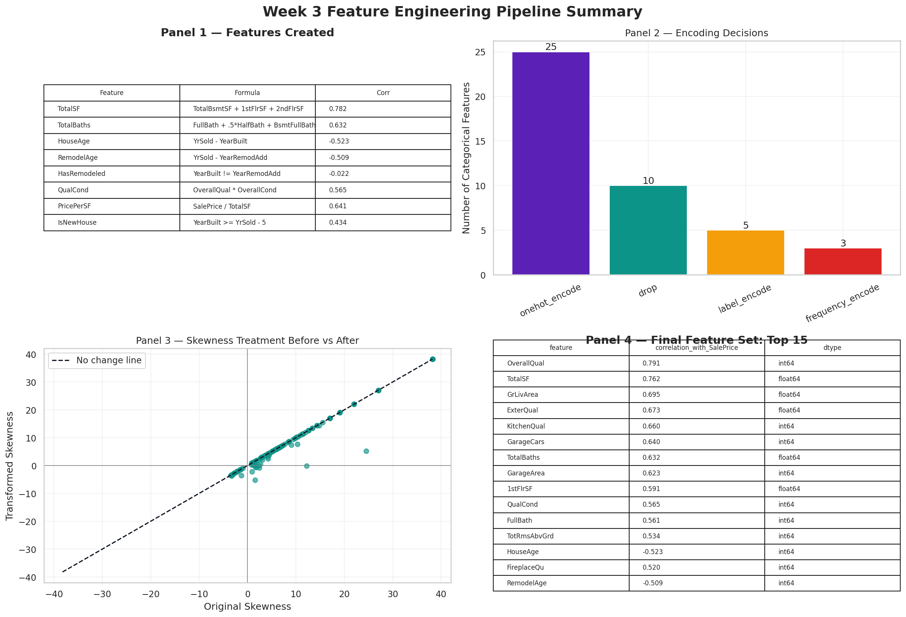

# AIML Internship Week 3 — House Price Visualization & Feature Engineering

## Dataset
House Prices — Advanced Regression Techniques (`train.csv`)

## 5 Key Findings
1. `SalePrice` is strongly right-skewed and benefits from transformation.
2. `OverallQual`, `TotalSF`, and `GrLivArea` are among the strongest price-related features.
3. Newer and recently remodeled houses generally show stronger pricing patterns.
4. Neighborhood and kitchen quality create clear price differences.
5. Feature engineering added strong signal through `TotalSF`, `TotalBaths`, and `QualCond`.

## Top 3 Engineered Features
- `TotalSF`
- `TotalBaths`
- `QualCond`

## Tools Used
Python, Pandas, NumPy, Matplotlib, Seaborn, Scikit-learn, SciPy

## Dashboard Screenshot

## Feature Engineering Pipeline

